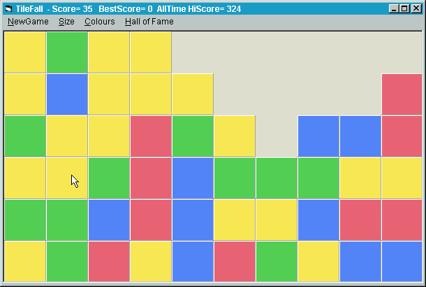



## TileFall

### Description

A very simple but highly addictive solitare game where the object is to remove large connected blocks of tiles with the same color. Make your mark in the hall of fame. 16 combinations from small to huge, 3 to 6 colours. To clear the hall of fame delete the .DAT file.
 
### More Info
 
Eye strain

             |
---                |---
**Submitted On**   |2001-08-04 23:23:06
**By**             |[Ron van Tilburg](https://github.com/Planet-Source-Code/PSCIndex/blob/master/ByAuthor/ron-van-tilburg.md)
**Level**          |Beginner
**User Rating**    |5.0 (10 globes from 2 users)
**Compatibility**  |VB 6\.0
**Category**       |[Games](https://github.com/Planet-Source-Code/PSCIndex/blob/master/ByCategory/games__1-38.md)
**World**          |[Visual Basic](https://github.com/Planet-Source-Code/PSCIndex/blob/master/ByWorld/visual-basic.md)
**Archive File**   |[TileFall24145852001\.zip](https://github.com/Planet-Source-Code/ron-van-tilburg-tilefall__1-25885/archive/master.zip)

### API Declarations

None - no dlls at all

